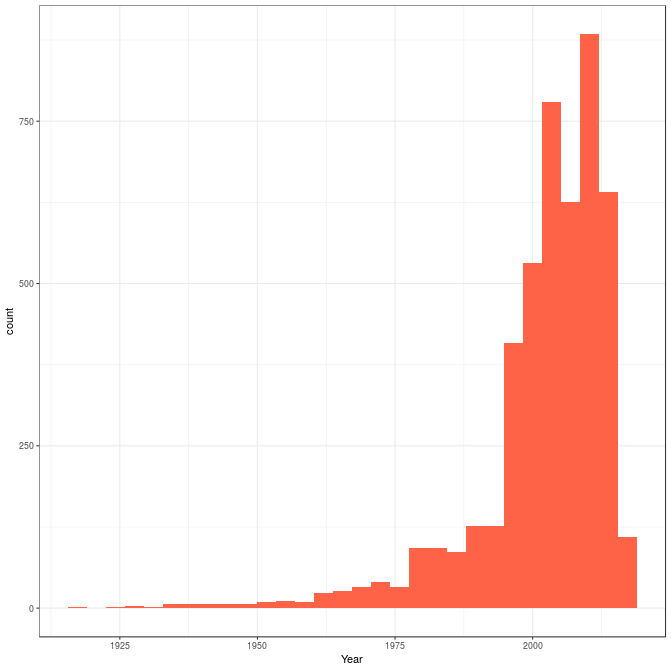
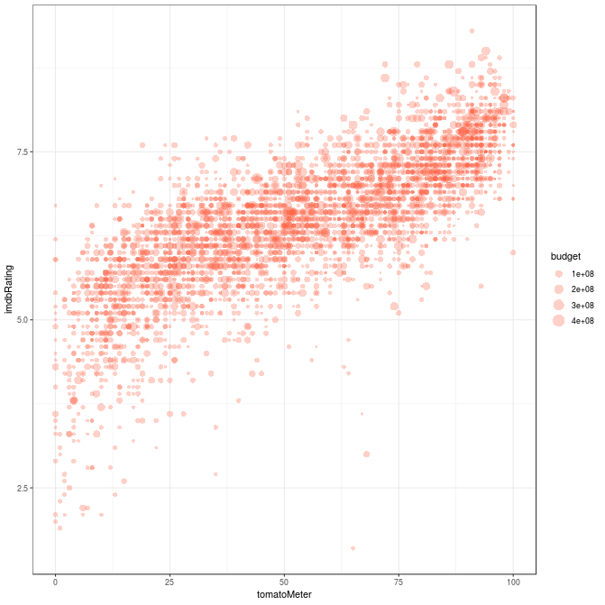
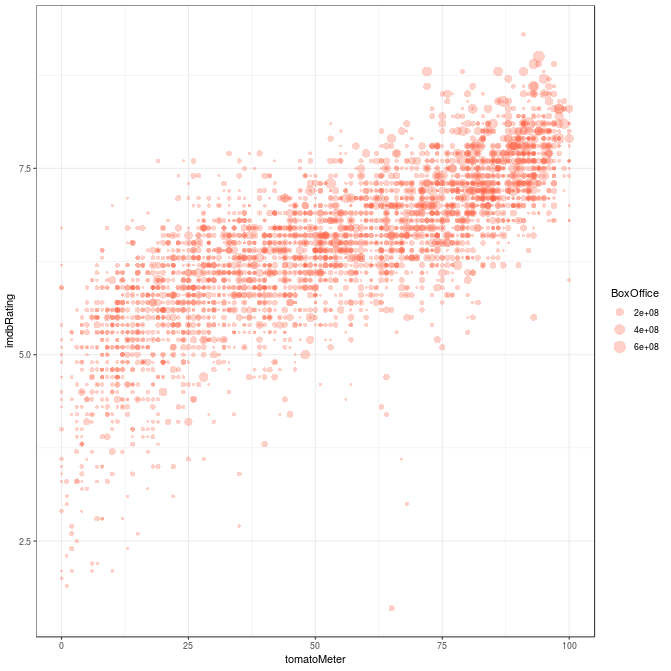
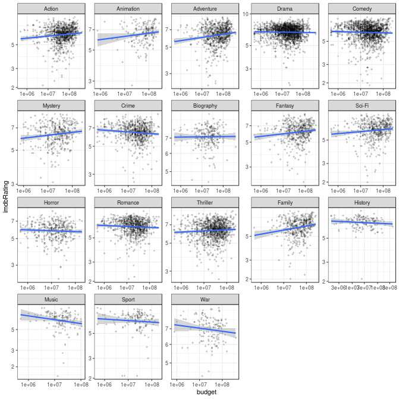
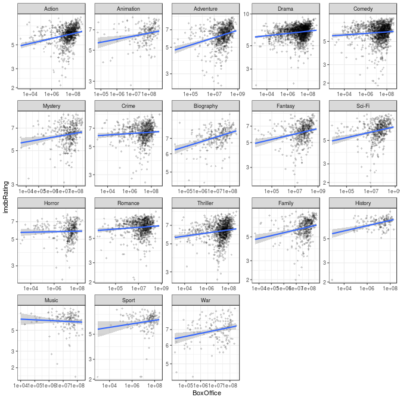
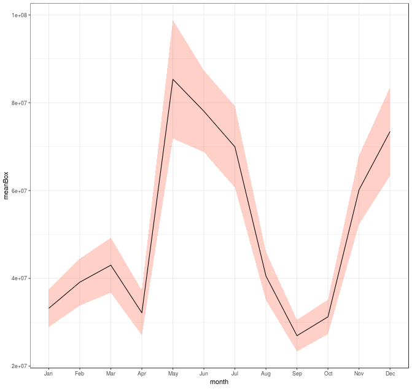

# A quick tutorial on dplyr (and tidyverse)

## What is Tidyverse?

The [tidyverse](https://www.tidyverse.org/) is a collection of R packages, including dplyr, which we will need for this tutorial. It was created by R guru Hadley Wickham (and many other people). The packages are for all the basics of data manipulation in R: reading, wrangling, and plotting your data.

Why not use base R? Tidyverse is SO MUCH BETTER than base R. It's simple, sensible, modern, user friendly, well documented, and intuitive. R started as a stats language, but now it's used for all kinds of general data such as genetic data, images, sounds. Here's a classic example.

Reading a spreadsheet in base R:

``` r
read.table(file="yourdata.csv", header=TRUE, stringsAsFactors=FALSE, sep=",")
```

In readr package:

``` r
read_csv(file="yourdata.csv")
```

### What dplyr is not

It's not "plyr". This is an old package, and comprises the initial iteration of what became dplyr and tidyverse. If you see a Stack Overflow answer that uses plyr, certainly there will be a better dplyr answer somewhere. Try not to use this package, as it has been retired.

### More info

Some elements of this tutorial are very closely based on the free online book "R for Data Science" by Hadley Wickham and Garrett Grolemund [https://r4ds.had.co.nz](https://r4ds.had.co.nz). This is definitely worth a read if you want to get to grips with dplyr. It doesn't take too long to go through and is very clear and easy to follow. It's a very worthwhile investment of your time!  

There are also various cheatsheets at [https://www.rstudio.com/resources/cheatsheets/](https://www.rstudio.com/resources/cheatsheets/), which provide good summaries of some of the functions you will be looking at and are useful as a quick reference guide (the Data Import and the Data Transformation ones are the most relevant for this session).


## Tibbles

These set of packages usually work best with "tibbles" which are an alternative dataframe format to R's traditional `data.frame()`. They are basically the same, but with some neat new features.

We will be working with tibbles today. If you have installed the tidyverse, this will have included the tibble package. If you want to find out more about how they work then there is a whole section on them in Chapter 10 of the book that I mentioned at the beginning. For now I will just give you the code that you need to use them.

To import data as a tibble you use `read_csv()` as opposed to `read.csv()`.

To change an existing data.frame to a tibble, you use `as_tibble()`.

You can create a new tibble from individual vectors using `tibble()`, e.g.

``` r
# first load tidyverse
library("tidyverse")
```

``` r
tibble(
  flowers = c("roses", "poppies"),
  number = c(5,6)
  )
```

Tibbles automatically print the first 10 rows and so you don't need to use `head()` to look at the top of your data.

However, if you do want to print everything then you can use e.g. `print(n=20 , width=Inf)`, where n is specifying the number of rows and width, the number of columns ("width = Inf" means all columns).

If you want to pull out a single variable, it's the same as in base R, or we can use `select()` (more later).


## Tidy Data

For the functions in dplyr to work, it is necessary to "tidy" your data. 

Tidy data in R has each column as a variable, each row as an observation and each cell as one value. This means that row names should not be used.
We will now cover the functions that can be used to tidy data. 

### `gather()`

`gather()` takes columns that are values of a variable and creates extra rows so that each row is showing just one observation.

Here is an example of an untidy data set, which is fictional data about the number of farms infected with foot and mouth during March and April:

``` r
# A tibble: 3 x 3
County        March April
<chr>         <dbl> <dbl>
Oxfordshire      20    24
Hertfordshire    89   103
Devon           300   293
```


(Code in R to create this tibble)
``` r
FootNMouth <- tibble(
  County = c("Oxfordshire", "Hertfordshire", "Devon"),
  March = c(20,89, 300),
  April = c(24,103,293),
  )
```

The problem with this dataset is that the column names are not names of variables, but values of a variable. March and April are values of the variable "Month" and so each row represented two observations, not one. 

This is the same data set, now tidied:

``` r
# A tibble: 6 x 3
County        Month `Number of farms infected`
<chr>         <chr>                      <dbl>
Oxfordshire   March                         20
Hertfordshire March                         89
Devon         March                        300
Oxfordshire   April                         24
Hertfordshire April                        103
Devon         April                        293
```

The tidy data above can be achieved using `gather()`:

``` r
gather(FootNMouth, March, April, key = "Month", value = "Number of farms infected")
```

Using `gather()`, you need to first need to specify the columns that represent values, not variables, in this case "March" and "April". 

Then you provide the name of the variable whose values are in the collumn names, so in this case "Month" and the name of the variable which is in the cells, "Number of farms infected". 

NOTE: If the columns that you are gathering do not start with a letter, then you need to surround them with backticks ` `` ` 

`spread()` does the opposite of `gather()`, it creates extra columns when an observation is scattered accross multiple rows.


### `separate()`

Sometimes you have one column with data in each row that you want to split into multiple columns.

For example, if you had one column with called "date", which had the date expressed as yyyy-mm-dd, but you wanted a column each for year, month and day.

`separate()` can achieve this by splitting wherever a separator character appears (in this case "-").

``` r
    separate(df, date, into = c("year", "month", "day"))
```

### `unite()`

`unite()` is the reverse of this. You specify the name of the new column as your first argument and then the names of the columns to merge. You can use "sep =" to specify what type of separator to use.

``` r
    unite(df, date, year, month, day, sep="-")
```


### Combining data sets

You can combine data from two data sets using the join functions, if they have a column(s) in common:

``` r
left_join(x,y)
right_join(x,y)
inner_join(x,y)
full_join(x,y)
```

For more information on these look at Chapter 13 of the book I mentioned, particularly section 13.4. 

## dplyr functions

Once you've got your data in tibble format and it is tidy, then you're ready to start using the dplyr functions. We will briefly go through what each one does here and then you can use this as a reference when you start to use them later on in the tutorial. 


### `filter()`

`filter()` is very similar to the `subset()` function in base R. However, it's good to use `filter()` alongside other dplyr functions and it can be faster when you have lots of data.

`filter()` subsets observations based on their values. 

So for example with the built in "starwars" data in R we can filter to find all the characters that have blue eyes:

``` r
filter(starwars, eye_color == "blue")
```

You can filter multiple columns simultaneously. Here we are filtering for humans that have blue eyes: 

``` r
filter(starwars, eye_color == "blue", species == "Human")
```

You always have the name of the tibble you want to filter as the first argument, followed by the arguments that specify the filtering.

You can use any of these comparison operators:

` > `, ` >= `, ` < `, ` <= ` , ` != ` (not equal to) and ` == ` (equal to)

or any of these logical operators:

` & ` (and) ` | ` (or) ` ! ` (not)

Be careful when using the logical operators, as you need to write out the same column multiple times if you are filtering for multiple things. For example if you wanted to find out which Star Wars characters had blue OR brown eyes you would need to write:

``` r
filter(starwars, eye_color == "blue" | eye_color == "brown")
```

not ... 

``` r
filter(starwars, eye_color == "blue" | "brown")
```

If this is still a bit confusing, the book I recommended explains this in more detail in Chapter 5.2.3).

One of the most useful operators I've found is: ` %in% ` which often can be used in place of some of the logical operators. For example if you wanted to find out which Star Wars characters had blue OR brown eyes, then for the blue OR brown example used above you could do:

``` r
filter(starwars, eye_color %in% c("blue", "brown"))
```

I find it most useful when using one dataframe to subset another one.

For example if I had an imaginary dataframe that had the student ID numbers of all students who had passed an exam (let's call it "passed") and then another dataframe containing information about all the students in the yeargroup, including their ID number (let's call it "studentInfo"), then we could filter the "studentInfo" dataframe using the studentID number to find out more information about only those students who had passed:

``` r
filter(studentInfo, studentInfo$studentID %in% passed$studentID)
```


### `arrange()`

This changes the order of rows based on columns and so for example, can be used in combination with `desc()` to re-order by a columnm in descending order. To rearrange the starwars data so that it is sorted from the character with the tallest height to the shortest height you can do:

``` r
arrange(starwars, desc(height))
```

This can be used in combination with lots of other functions. Missing values are always sorted at the end. 


### `select ()`

Select allows you to select specific columns that you want, e.g.

``` r
select(starwars, name, height, homeworld)
```

and can be used alongside the functions:

`starts_with("un")` - matches names that begin with "un".

`ends_with("ing")` - matches names that end with "ing".

`contains("he")`- matches names that contain "he".

`matches(".(.)\\1")` - selects variables that match a regular expression. Find out more about this in Chapter 14 "strings" of the book.

`num_range("y", 2:4)` - matches y2, y3, and y4.


### `rename()`

`rename()` can be used to rename columns

``` r
rename(starwars, name = Name)
```


### `mutate()`

You can add new columns with mutate that can use data from other columns. Say we wanted to calculate the BMI of the Star Wars characters. 
We could use the "height" and "mass" columns (not certain of their units, but doesn't matter for the sake of this example), as BMI is your weight divided by your height squared (in centimeters).

``` r
mutate(starwars, BMI = mass/((height)^2))
```


### `summarise()` and `group_by()`

`summarise()` collapses a data frame into a single row. It is commonly used alongside `group_by()` which means that dplyr functions can be applied by group. It is also usually used with other functions such as `mean()`, `median()` etc.

If we wanted to find the mean height of the Star Wars characters by species then we would do:

``` r
heightSW <- group_by(starwars, species)
summarise(heightSW, AvHeightPerSp = mean(height, na.rm = TRUE))
```

`summarise()` and `group_by()` are often used with the pipe, which we will now get on to explaining ...

## The pipe

The pipe is written as ` %>% ` and can be interpreted as "then". 

It allows for results from one step, function or transformation to go straight to the next step, without needing to make intermediate objects.

So for example, if you had wanted to do find the average height of Star Wars characters by species as we had just described, but then arrange it in descending order (with `arrange()` and `desc()` as described earlier) then you could do the following:

``` r
AVHeightSPDf <- starwars %>%
  group_by(species) %>%
  summarise(AvHeightPerSp = mean(height, na.rm = TRUE)) %>%
  arrange(desc(AvHeightPerSp))
```
  
To describe this code in words, I would say:
  
 (1) Create an object called "AVHeightSPDf". This will contain the results of the following:
 (2) You have the dataframe called "starwars"
 (3) Then group it by the column "species"
 (4) Then make a new column called "AVHeightPerSP" containing the mean height per species. Remove any NAs
 (5) Then rearrange the AVHeightPerSP column in descending order 
 
You can also use backward-piping, which means that instead of needing to create an new object, it will override the previous version of data that you are using. It's really handy to make the code more concise, but do be careful with it!

First load the "magrittr" package:

``` r
library("magrittr")
```

The same example, overwriting the starwars dataframe:

``` r
starwars %<>%
  group_by(species) %>%
  summarise(AvHeightPerSp = mean(height, na.rm = TRUE)) %>%
  arrange(desc(AvHeightPerSp))
```


## A real life example: movies!

Please now install the "lubridate" packages. 

``` r
library("lubridate")
```

Download the data as a zip from , then unpack and set as your working directory.

Here we are going to analyse some real world data for movies. But because it it's someone else's data, we need to clean it first.

Here we have a dataset of various movie data. They are in several CSV files, so we read these in using `lapply()` and `read_csv()`. We specify our NAs too:

``` r
# comment
movies.data.list <- lapply(list.files(pattern=".csv"),read_csv,na=c("","NA","N/A"))
```

Now we merge all six dataframes together: 

``` r
# join together
movies.data <- bind_rows(movies.data.list)
```

``` r
# take a look
movies.data %>% glimpse()
```

Now clean it up, removing percent signs, coverting dates to date format, and dollar revenue and runtime to numeric. Then we ditch the columns we do't want with `select()`.

``` r
# edit and remove junk columns
movies.data %<>% 
    mutate(tomatoMeter=as.numeric(str_replace_all(tomatoMeter,"%","")), 
        Released=ymd(Released), 
        BoxOffice=as.numeric(str_replace_all(BoxOffice,"\\$|,","")),
        Runtime=as.numeric(str_replace_all(Runtime," min","")),
        month=month(Released,label=TRUE)) %>%
    select(-Type,-tomatoImage,-tomatoRating,-tomatoReviews,-tomatoFresh,-tomatoRotten,-tomatoConsensus,
        -tomatoUserMeter,-tomatoUserRating,-tomatoUserReviews,-tomatoURL,-DVD,-Website,-Response,-Season,
        -Episode,-seriesID,-totalSeasons,-ratingSite)
```

``` r
# take a look
movies.data %>% glimpse()
```

Those data don't have movie budgets though, which is important, so we get these from another TSV file.

``` r
# read in the budget data
budget.data <- read_tsv("movie-budgets.tsv")
```

``` r
# take a look
budget.data %>% glimpse()
```

To merge it with the other dataset we need a identifiers in common, in this case the IMDB code. But in this dataset this code is buried in a URL. We clean it:

``` r
# get IMDB id
budget.data %<>% 
    mutate(imdbID=str_split_fixed(url,"/",6)[,5]) %>%
    select(imdbID,budget,gross)
```

``` r
# take a look
budget.data %>% glimpse()
```

Now we can merge it with the other dataset by the new IMDB code.

``` r
# join dataframes
movies.joined <- left_join(movies.data, budget.data,by="imdbID")
```

Here because some of the data is duplicated between the two datasets, we replace any missing box office data, with movie gross data using `if_else()` and `mutate()`. 

``` r
# check for missing data add any missing BoxOffice data
movies.joined %>% filter(is.na(BoxOffice))
movies.joined %<>% mutate(BoxOffice=if_else(is.na(BoxOffice),gross,BoxOffice))
```

Here we use `summarise()` to look at the descriptive stats for the data.

``` r
# make a quick summary of some stats
movies.joined %>% 
    summarise(
        nmovies=length(unique(imdbID)), 
        maxDur=max(Runtime,na.rm=TRUE), 
        minDur=min(Runtime,na.rm=TRUE), 
        minBudget=min(budget,na.rm=TRUE), 
        maxBudget=max(budget,na.rm=TRUE),
        minYear=min(Year,na.rm=TRUE), 
        maxYear=max(Year,na.rm=TRUE)
        )
```

We can plot it too!

``` r
# plot movies per year
movies.joined %>% ggplot(aes(Year)) + geom_histogram(fill="tomato") + theme_bw()
```



Having a look at the data, we see there are some duplicate entries and spurious outliers that we can remove:

``` r
# remove outliers
movies.joined %<>% 
    distinct() %>% 
    filter(between(Runtime,60,240), between(budget,500000,500000000), between(Year,1977,max(Year,na.rm=TRUE)))
```

Now we can do some visualisations (and removing NAs). Here is Rotten Tomatoes score plotted against IMDB rating, with dot size according to movie budget.

``` r
# plot tomato rating against imdb rating
movies.joined %>% 
    filter(!is.na(tomatoMeter) & !is.na(imdbRating) & !is.na(budget) & !is.na(BoxOffice)) %>% 
    ggplot(aes(x=tomatoMeter,y=imdbRating,size=budget)) + 
    geom_point(alpha=0.3,shape=16,colour="tomato") +
    theme_bw()
```



Here is Rotten Tomatoes score plotted against IMDB rating, with dot size according to movie gross at the box office.

``` r
# plot tomato rating against imdb rating
movies.joined %>% 
    filter(!is.na(tomatoMeter) & !is.na(imdbRating) & !is.na(budget) & !is.na(BoxOffice)) %>% 
    ggplot(aes(x=tomatoMeter,y=imdbRating,size=BoxOffice)) + 
    geom_point(alpha=0.3,shape=16,colour="tomato") +
    theme_bw()
```



Now we can analyse by genre, but first we need to tidy the data, as the genre is concatentated in one column. We "gather" the data so genre is one column, and entries are duplicated according to multiple columns. We also count the number of movies per genre using `group_by()` and `mutate()`.

``` r
# gather by genre
movies.data.genre <- movies.joined %>% 
    separate(Genre, into=c("genre1","genre2","genre3","genre4","genre5","genre6","genre7","genre8"), sep=", ") %>% 
    gather(key="genreN",value="Genre",genre1,genre2,genre3,genre4,genre5,genre6,genre7,genre8, na.rm=TRUE) %>% 
    group_by(Genre) %>% 
    mutate(perGenre=length(unique(imdbID))) %>% 
    ungroup() %>% 
    select(-genreN) %>% 
    mutate(Genre=as_factor(Genre))
```

Now we can plot by genre (removing the rare genres), looking at an association between movie budget and IMDB rating. We need a log10 scale.

``` r
# filter NAs and plot
movies.data.genre  %>% 
    filter(!is.na(budget) & !is.na(BoxOffice) & !is.na(imdbRating) & !is.na(tomatoMeter)) %>% 
    filter(perGenre > 100) %>% 
    ggplot(aes(x=budget,y=imdbRating)) +
    geom_point(alpha=0.2,shape=18) + 
    scale_x_log10() + 
    scale_y_log10() + 
    geom_smooth(method="lm") + 
    facet_wrap(~Genre, scales="free") + 
    theme_bw()
```



Now we can plot movie gross against IMDB rating:

``` r
movies.data.genre  %>% 
    filter(!is.na(budget) & !is.na(BoxOffice) & !is.na(imdbRating) & !is.na(tomatoMeter)) %>% 
    filter(perGenre > 100) %>% 
    ggplot(aes(x=BoxOffice,y=imdbRating)) + 
    geom_point(alpha=0.2,shape=18) + 
    scale_x_log10() + 
    scale_y_log10() + 
    geom_smooth(method="lm") + 
    facet_wrap(~Genre, scales="free") + 
    theme_bw()
```



Now lets look at who the best directors are by IMDB rating (that have more than 5 movies in the dataset) ...

``` r
# filter, clean, summarise
movies.data %>% 
    filter(!is.na(Director) & !is.na(imdbRating)) %>% 
    mutate(Director=str_replace_all(Director,", .+","")) %>% 
    group_by(Director) %>% 
    summarise(meanIMDB=mean(imdbRating),sd=sd(imdbRating),nMovies=length(unique(imdbID))) %>%
    filter(nMovies >= 5) %>%
    arrange(desc(meanIMDB)) %>% # best
    #arrange(meanIMDB) %>% # best
    #arrange(desc(sd)) %>% # inconsistent
    print(n=20)
```

``` r
# A tibble: 170 x 4
Director              meanIMDB    sd nMovies
<chr>                    <dbl> <dbl>   <int>
Christopher Nolan         8.41 0.538       8
Quentin Tarantino         8.16 0.421       8
James Cameron             7.9  0.451       7
Alejandro G. Inarritu     7.8  0.245       5
Peter Jackson             7.8  0.766       9
David Fincher             7.75 0.721      10
Martin Scorsese           7.62 0.621      16
Wes Anderson              7.61 0.363       7
Paul Thomas Anderson      7.53 0.589       6
Paul Greengrass           7.47 0.544       7
Darren Aronofsky          7.46 0.996       5
Danny Boyle               7.44 0.577       7
Sam Mendes                7.44 0.556       7
Steven Spielberg          7.44 0.776      25
Alexander Payne           7.4  0.2         5
Robert Zemeckis           7.38 0.774      12
Mike Leigh                7.36 0.351       5
Richard Linklater         7.35 0.688      10
John Lasseter             7.34 0.808       5
Jean-Pierre Jeunet        7.3  0.778       5
# ... with 150 more rows
```

`arrange()` by standard deviation to get the most inconsistent directors. 

``` r
# A tibble: 170 x 4
Director              meanIMDB    sd nMovies
<chr>                    <dbl> <dbl>   <int>
Jon M. Chu               5.28  2.07       5
Guy Ritchie              7.11  1.60       7
John McTiernan           6.64  1.47      10
Robert Rodriguez         5.6   1.43      12
Paul Verhoeven           6.58  1.33       5
Malcolm D. Lee           5.62  1.31       5
Jan de Bont              5.54  1.30       5
M. Night Shyamalan       6.03  1.28       9
Michael Polish           5.8   1.26       5
Curtis Hanson            6.65  1.23       6
Lana Wachowski           6.88  1.18       6
Kenny Ortega             5.8   1.17       5
David O. Russell         6.75  1.16       8
Francis Ford Coppola     6.94  1.10       8
Chris Weitz              6.1   1.08       5
Mark Neveldine           5.64  1.06       5
Spike Lee                6.6   1.06      14
Dennis Dugan             5.72  1.04       9
Joel Schumacher          6.33  1.03      12
Ben Stiller              6.34  1.02       5
# ... with 150 more rows
```

Now we can look at average movie takings over the course of a year. You get the idea ...

``` r
# takings by month
movies.data %>% 
    filter(!is.na(BoxOffice) & !is.na(month)) %>% 
    group_by(month) %>% 
    summarise(meanBox=mean(BoxOffice),sd=sd(BoxOffice),n=length(unique(imdbID)),CI=qnorm(0.975)*sd/sqrt(n)) %>% 
    ggplot(aes(x=month,y=meanBox,group=1)) + 
    geom_ribbon(aes(ymax=meanBox+CI,ymin=meanBox-CI,group=1),fill="tomato",alpha=0.3) + 
    geom_line() +
    theme_bw()
```



## Competition

So, there's alot one can do with this movie dataset. Have a go at making an interesting statistic or visualisation using some dplyr. Good luck!
